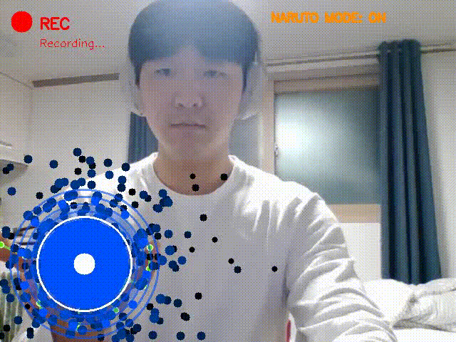
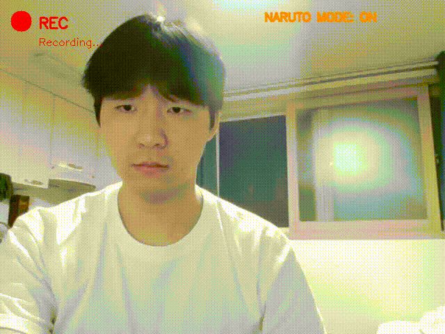
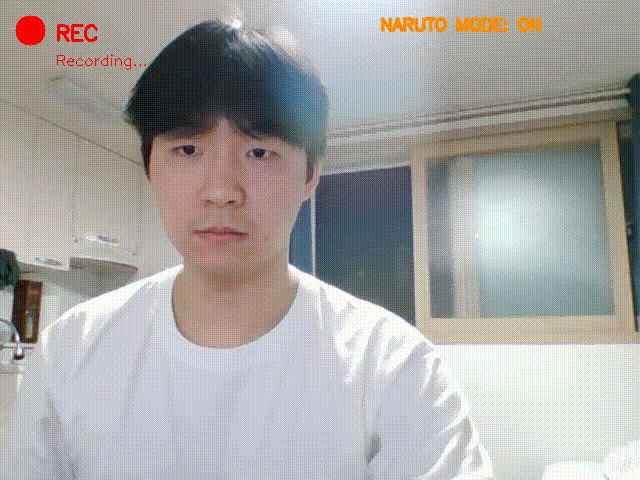
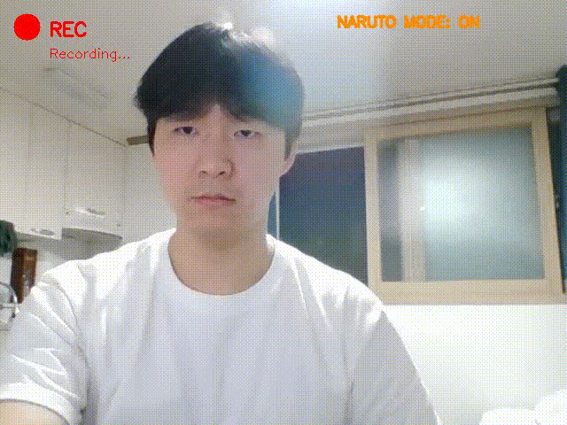
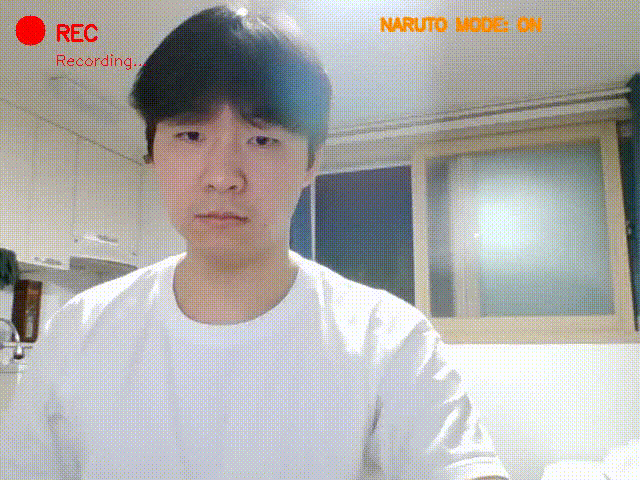

# 🥷 naruto_vision

OpenCV와 MediaPipe를 이용한 웹캠 녹화 + 나루토 닌자 기술 이펙트 프로그램

## 

## 🎬 주요 기능

### 1. 실시간 영상 녹화

- 웹캠 영상을 실시간으로 캡처 (거울 모드)
- **Preview 모드**: 영상 확인만 (녹화 없음)
- **Record 모드**: AVI 파일로 저장 (`recordings/` 폴더, XVID 코덱)
- 파일명: `recording_YYYYMMDD_HHMMSS.avi`

### 2. 🥷 나루토 기술 이펙트

- MediaPipe `HandLandmarker`로 손 관절 21개를 실시간 추적
- 손 제스처를 인식하여 5가지 닌자 기술 이펙트 발동
- 녹화 중에도 이펙트가 영상에 함께 저장됨

---

## 🌀 나루토 기술 목록

| 제스처                            | 기술                             | 이펙트                                  |
| --------------------------------- | -------------------------------- | --------------------------------------- |
| 🖐️ 손 활짝 + 손바닥 위            | 螺旋丸 **RASENGAN**              | 파란 나선 구체 (시간에 따라 성장)       |
| ✌️ 검지 + 중지 V사인              | 影分身 **KAGE BUNSHIN**          | 연기 + 좌우 분신 2개 등장               |
| 🤲 양손 검지+중지 위로            | 火遁・豪火球 **KATON**           | 화면 전체를 뒤덮는 불꽃 폭발            |
| 🤝 양손 위아래 겹침 1.5초         | 千鳥 **CHIDORI**                 | 파란 번개가 손에서 튀는 효과            |
| 🙌 양손 손가락 위로 모아 붙임 1초 | 木遁・真数千手 **MOKUTON SENJU** | 거대한 나무 팔 14개가 반원으로 솟아오름 |

### 기술 상세

- **RASENGAN**: 유지 시간에 따라 코어 반지름이 18→120px 성장, 파란 나선·글로우·파티클
- **KAGE BUNSHIN**: 3초(90프레임) 유지 시 분신 2개가 좌우 등장, 카운트다운 게이지 표시
- **KATON**: charge → expand → smoke → clear 4단계로 화면 전체 폭발 연출
- **CHIDORI**: 양손을 위아래로 겹친 상태 1.5초 유지 후 발동, 파란 번개 이펙트
- **MOKUTON SENJU**: 양손 4손가락을 위로 펴서 손목을 붙인 상태 1초 유지 후 발동. 화면 하단(사용자 몸 뒤)에서 14개의 나무 팔이 반원을 그리며 솟아오름. 팔마다 갈색 계열 4겹 그라디언트·마디 링·손바닥+손가락 렌더링

### 기술 미리보기

| RASENGAN                 | KAGE BUNSHIN                | KATON                 |
| ------------------------ | --------------------------- | --------------------- |
|  |  |  |

| CHIDORI                 | MOKUTON SENJU           |
| ----------------------- | ----------------------- |
|  |  |

---

## ⌨️ 키 조작

| 키      | 동작                       |
| ------- | -------------------------- |
| `SPACE` | Preview ↔ Record 모드 전환 |
| `N`     | 나루토 모드 ON/OFF 토글    |
| `ESC`   | 프로그램 종료              |

---

## 🛠️ 설치 방법

### 필수 요구사항

- Python 3.10 이상
- Windows / macOS / Linux

### 패키지 설치

```bash
pip install -r requirements.txt
```

### MediaPipe 모델 파일 다운로드

```bash
curl -L -o hand_landmarker.task \
  https://storage.googleapis.com/mediapipe-models/hand_landmarker/hand_landmarker/float16/1/hand_landmarker.task
```

---

## 🚀 실행 방법

```bash
python video_recorder.py
```

---

## 📁 파일 구조

```
naruto_vision/
├── video_recorder.py       # 메인 프로그램 (녹화 + UI)
├── naruto_jutsu.py         # 나루토 기술 인식 & 이펙트 모듈
├── hand_landmarker.task    # MediaPipe 손 인식 모델
├── requirements.txt        # 의존성 목록
├── README.md               # 이 파일
└── recordings/             # 녹화 파일 저장 폴더 (자동 생성)
    └── recording_YYYYMMDD_HHMMSS.avi
```

---

### 주요 설정 값

- 해상도: 640×480 (패널 포함 시 640×660)
- 녹화 FPS: 20 / 감지 FPS: 30
- 코덱: XVID / AVI
- 제스처 안정화: 8프레임 버퍼
- CHIDORI 차징: 45프레임 (1.5초)
- MOKUTON SENJU 차징: 30프레임 (1초)

---

## ❓ 문제 해결

### 카메라를 열 수 없는 경우

- 다른 프로그램이 카메라를 사용 중인지 확인
- Windows: 설정 → 개인 정보 보호 → 카메라 권한 확인
- macOS: 시스템 환경설정 → 개인 정보 보호 → 카메라 권한 확인

### 나루토 기술이 인식되지 않는 경우

- 조명이 충분한 환경에서 시도
- 손 전체가 카메라에 보이도록 거리 조절
- `hand_landmarker.task` 파일이 프로젝트 폴더에 있는지 확인
- MOKUTON SENJU: 양손 손목을 최대한 가까이 붙이고 4손가락(엄지 제외)을 모두 위로 편 상태 유지

### 한글이 깨지는 경우

- Windows: `C:\Windows\Fonts\malgun.ttf` (맑은 고딕) 존재 여부 확인
- macOS: `/System/Library/Fonts/AppleSDGothicNeo.ttc` 확인
- Linux: `sudo apt install fonts-nanum` 으로 나눔폰트 설치

---

## 📄 라이선스

MIT License
